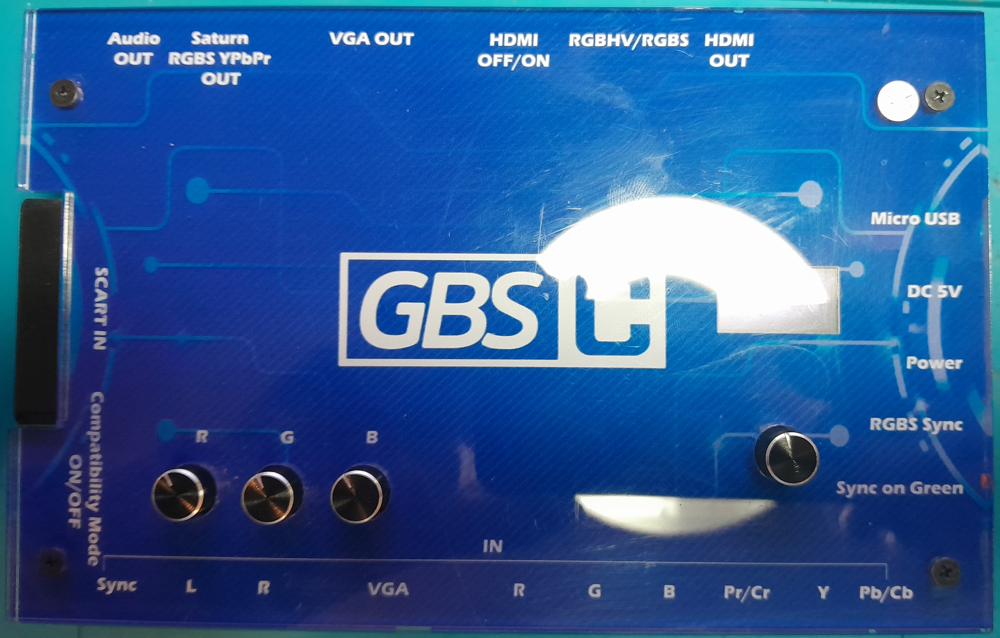
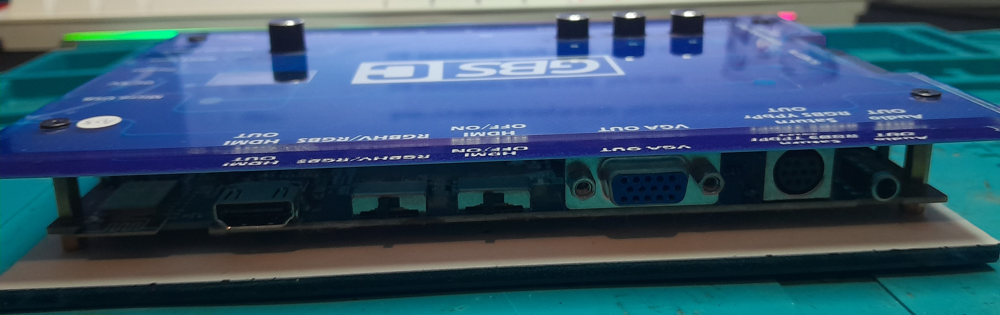
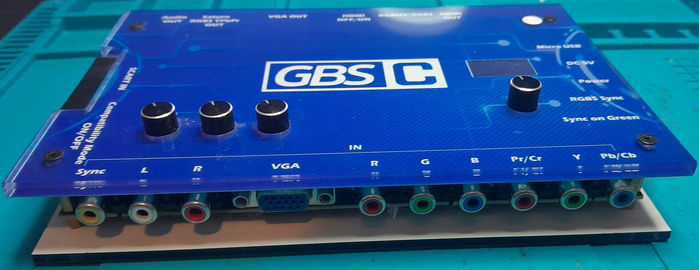
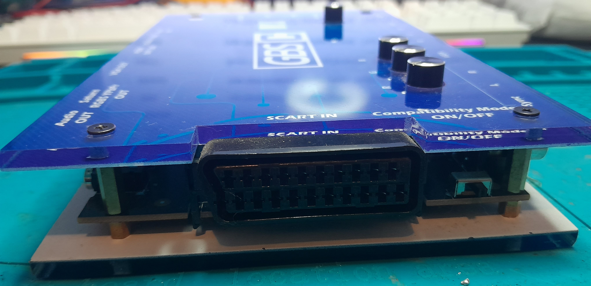
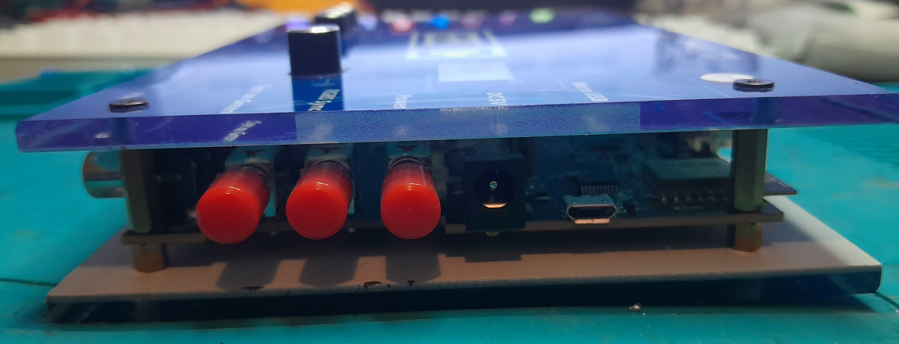
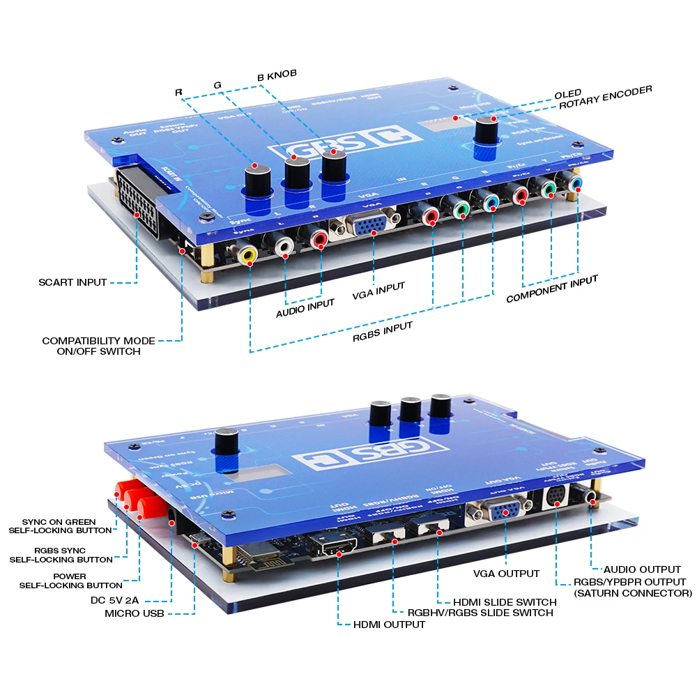
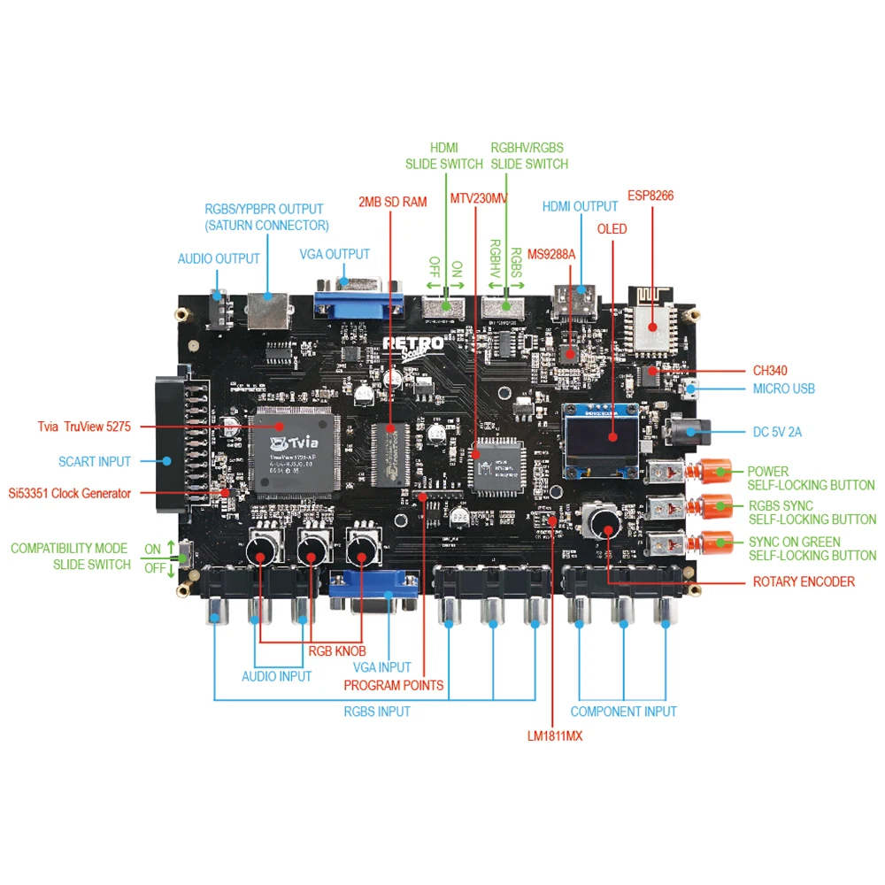

# GBS Control (RetroScaler)

### Info

[RetroScaler GitHub repository with firmware updates](https://github.com/RetroScaler/GBSC)

##### Front

- RGB Knobs
- OLED Screen
- Rotatory Encoder

##### Bottom

Audio Input:

- L (White)
- R (Red)

Video Inputs:

- VGA

RGBS Input

- Sync (Yellow)
- R
- G
- B

Component Input:

- Pr/Cr (Red)
- Y (Green)
- Pb/Cb (Blue)

##### Left

- Scart Input
- Compatibility Mode ON/OFF

##### Top

Outputs:

- Audio OUT
- Saturn RGBS YPbPr OUT
- VGA OUT
- HDMI OUT

Switches:

- HDMI OFF/ON
- RGBHV/RGBS

##### Right

- Micro USB (Firmware Update)
- DC 5V (Power Supply)
- Power (Button)
- RGBS Sync (Button)
- Sync on Green (Button)

#### Presets

- [Sega Saturn](presets/sega-saturn/README.md)

#### Purchase Links (AliExpress)

- [RetroScaler Official Store](https://s.click.aliexpress.com/e/_DDfURmP)
- [BitFunx Game Store](https://s.click.aliexpress.com/e/_DdfGnu3)
- [Retrogaming Store](https://s.click.aliexpress.com/e/_DBy5rAr)

#### Images

Front:

Top:

Bottom:

Left:

Right:

