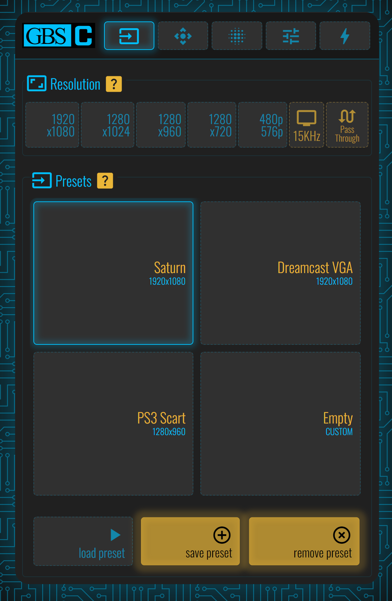
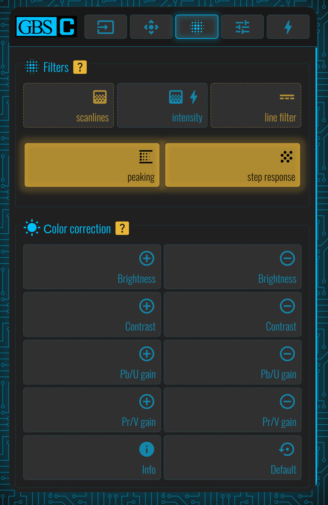

# GBS Control - Sega Saturn Preset

### Info

##### First Page

- <b>Resolution:</b> 1920x1080
- <b>Presets:</b> "Saturn"

##### Second Page

- <b>ADC Gain (brightness):</b> Auto Gain

Picture Control:

- <b>Move:</b> Leave it at center of screen/tv
- <b>Scale:</b> HScale: 1021, VScale: 455
- <b>Borders:</b> Add until all game screen is shown

##### Third Page

Filters:

- <b>Scanlines:</b> OFF :x:
- <b>Intensity:</b> OFF :x:
- <b>Line Filter:</b> OFF :x:
- <b>Peaking:</b> ON :white_check_mark:
- <b>Step Response:</b> ON :white_check_mark:

Picture Control:

- <b>Move:</b> Leave it at center of screen/tv
- <b>Scale:</b> HScale: 1021, VScale: 455
- <b>Borders:</b> Add until all game screen is shown

##### Fourth Page

Settings:

- <b>Matched Presets:</b> ON :white_check_mark:
- <b>Full Height:</b> ON :white_check_mark:
- <b>Low Res: Use Upscaling:</b> ON :white_check_mark:
- <b>Output RGBHV/Component:</b> OFF :x:
- <b>Output Frame Rate: Force PAL 50Hz to 60Hz:</b> OFF :x:
- <b>Output RGBHV/Component:</b> OFF :x:
- <b>ADC calibration:</b> ON :white_check_mark:
- <b>Developer Mode:</b> ON :white_check_mark:
- <b>Save Filtering Per Slot:</b> OFF :x:

Active FrameTime Lock:

- <b>FrameTime Lock:</b> OFF :x:

Deinterlace Method:

- <b>Motion Adaptive:</b> ON :white_check_mark:
- <b>Bob:</b> OFF :x:

##### Fifth Page

Nothing is selected

##### Sixth Page

GBS Control is connected to my WI-FI access

#### Images

